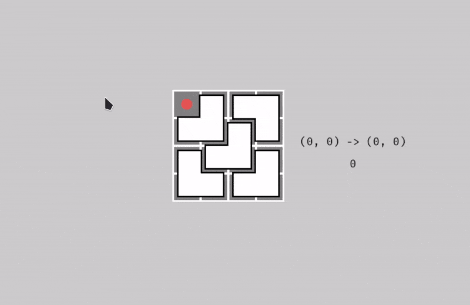

# Visualizer for VNOI Cup 2025 - Round 1 - problem D

This is a quick visualizer for the [VNOI Cup 2025 Round 1 problem D](https://oj.vnoi.info/problem/vnoicup25_r1_d).



It is meant to be _quick_, so all of the parameters are hardcoded inside the main source file.

Change the value `K` for the board size.

## Running


```bash
cargo run --bin vis
```

## Usage

Use your mouse to click on the tile that you want it to be _uncovered_.
